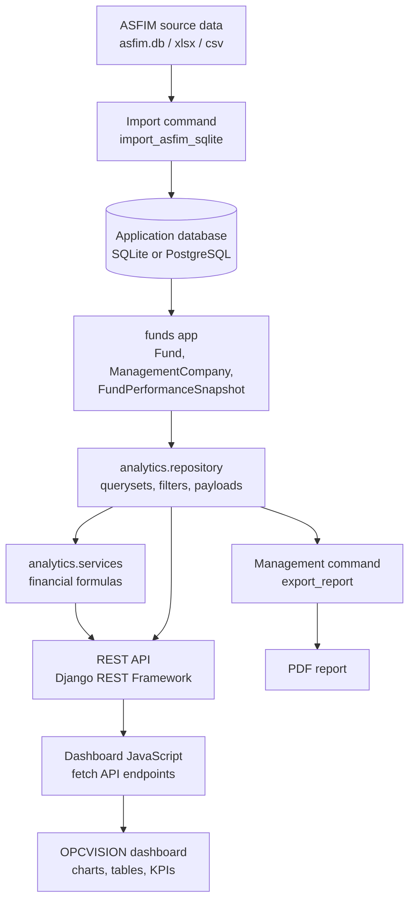
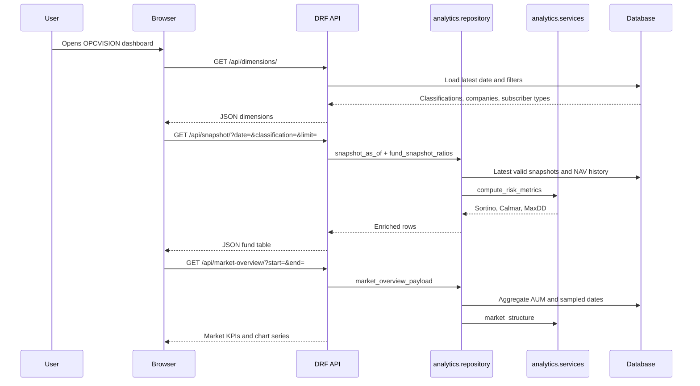

# OPCVISION

**OPCVISION** is a Django and Django REST Framework analytics platform for Moroccan OPCVM funds.

Built by **Hamza Ahrim**.

GitHub: [hamzaahrim0](https://github.com/hamzaahrim0)

The application turns ASFIM/OPCVM fund data into an interactive dashboard with market overview, fund explorer, NAV comparison, S-R flow decomposition, risk ratios, category ranking, and competitive watchlist analytics.

## What The Project Does

OPCVISION reads normalized OPCVM data from SQLite or PostgreSQL and exposes it through:

- A web dashboard at `/`
- A REST API under `/api/`
- Server-side analytics for market concentration, flow decomposition, NAV series, risk ratios, and competitive scoring
- Import/export commands for ASFIM data and reports

The dashboard is built for analysis, not marketing. It is dense, filterable, and designed for repeated use by someone comparing funds, management companies, classifications, and flows.

## Main Features

- Market AUM overview with total assets, AUM variation, fund count, company count, HHI, Top 3 and Top 5 concentration
- Market breakdown by management company, legal nature, classification, and subscriber type
- Time series of market AUM
- Category ranking by S-R effect, performance effect, or one-year performance
- Competitive watchlist by management company with scoring scenarios
- Fund comparator with base-100 or raw NAV chart
- S-R flow decomposition by fund and over time
- Snapshot explorer with fund-level values, performance, sensitivity, Sortino, Calmar, and Max Drawdown
- Dark/light UI theme
- REST API for all dashboard data

## Architecture Flowchart



## Request/Data Flow



## Business Logic

### Snapshot-As-Of Logic

The dashboard needs one current row per fund, but publication dates are not always identical across funds. `snapshot_as_of` selects the latest available `FundPerformanceSnapshot` per fund that is:

- On or before the selected date
- Not older than the configured staleness window
- Compatible with the active filters

This prevents the dashboard from summing raw rows from only one publication day when some funds report on a nearby date.

### Sensitivity Rule

Sensitivity is not treated as a universal ratio. It is a rate-risk measure and is only exposed for rate-sensitive classifications:

- `MONÉTAIRE`
- `OCT`
- `OMLT`

For `ACTIONS`, `DIVERSIFIÉ`, and `CONTRACTUEL`, the API returns `null` for `sensitivity`, even if the raw legacy field contains `-`.

The rule follows AMMC classification logic:

- Monetary funds have sensitivity around/under `0.5`
- OCT funds are short-term bond funds, generally around `0.5` to `1.1`
- OMLT funds are medium/long-term bond funds, generally above `1.1`

### S-R Decomposition

The S-R effect estimates subscriptions/redemptions by separating net-asset changes into:

```text
delta_AN = AN_t - AN_t-1
performance_effect = AN_t-1 * (VL_t / VL_t-1 - 1)
sr_effect = AN_t - AN_t-1 * (VL_t / VL_t-1)
sr_pct = sr_effect / AN_t-1 * 100
```

Where:

- `AN` is net assets
- `VL` is NAV
- `t` is the current observation
- `t-1` is the previous observation

The result estimates how much of the change came from market performance versus subscriptions/redemptions.

### Risk Ratios

Risk metrics are computed from NAV history:

```text
periodic_return_t = VL_t / VL_t-1 - 1
annualized_return = mean(periodic_return) * annualization_factor
annualized_volatility = sample_std(periodic_return) * sqrt(annualization_factor)
Sharpe = (annualized_return - risk_free_rate) / annualized_volatility
Sortino = (annualized_return - risk_free_rate) / downside_volatility
max_drawdown = min(VL_t / running_max(VL) - 1)
Calmar = annualized_return / abs(max_drawdown)
```

The annualization factor is inferred from the data:

- `252` for daily-like histories
- `52` for weekly-like histories

The snapshot endpoint computes `sortino`, `calmar`, and `max_drawdown` per visible fund over a trailing three-year window ending at each fund snapshot date. This avoids using future NAV observations in historical as-of views.

### Market Concentration

Market concentration is computed from management company AUM:

```text
share_i = AUM_i / total_AUM * 100
HHI = sum(share_i ** 2)
```

The HHI is computed on the 0-100 percentage scale.

### Competitive Score

The competitive watchlist scores management companies using percentile ranks and scenario weights.

Available scenarios:

- `balanced`
- `growth`
- `defensive`

Core components:

- Market share
- Share gain
- Collection rate
- Performance
- Estimated revenue

Each component is converted into an intra-sample percentile, weighted, clipped to `[0, 100]`, and mapped to a profile/priority.

## API Reference

All analytics endpoints support common filters when applicable:

- `classification`
- `subscriber_type`
- `management_company`
- `start`
- `end`
- `date`

### Health

```http
GET /api/health/
```

Returns plain text:

```text
ok
```

### Dimensions

```http
GET /api/dimensions/
```

Returns available filter dimensions and dataset date range.

Example fields:

- `latest_date`
- `earliest_date`
- `classifications`
- `subscriber_types`
- `management_companies`

### Funds

```http
GET /api/funds/
```

List funds with pagination.

Query parameters:

- `management_company`
- `classification`
- `subscriber_type`
- `search`

Example:

```http
GET /api/funds/?search=AD%20BONDS
```

### Fund Detail

```http
GET /api/funds/{isin}/
```

Returns fund metadata, latest snapshot, and fund risk metrics.

### Fund History

```http
GET /api/funds/{isin}/history/?start=YYYY-MM-DD&end=YYYY-MM-DD
```

Returns all snapshots for one fund over the selected period.

### Snapshot

```http
GET /api/snapshot/?date=YYYY-MM-DD&classification=OMLT&limit=120
```

Returns the latest valid snapshot per fund as of a selected date.

Important output fields:

- `date`
- `periodicity`
- `isin`
- `fund_name`
- `management_company`
- `classification`
- `sensitivity`
- `subscriber_type`
- `net_assets`
- `nav`
- `perf_ytd`
- `perf_1d`
- `perf_1w`
- `perf_1m`
- `perf_3m`
- `perf_6m`
- `perf_1y`
- `perf_2y`
- `perf_3y`
- `perf_5y`
- `sortino`
- `calmar`
- `max_drawdown`
- `risk_observations`
- `risk_reason`

### Market Share

```http
GET /api/market-share/?date=YYYY-MM-DD
```

Returns market concentration by management company:

- `hhi`
- `top3`
- `top5`
- `leader`
- `leader_share`
- `shares`

### Market Overview

```http
GET /api/market-overview/?start=YYYY-MM-DD&end=YYYY-MM-DD
```

Returns dashboard market KPIs:

- Total AUM
- AUM change
- AUM change percentage
- Fund count
- Management company count
- HHI
- Top 3 and Top 5 shares
- Breakdown by company
- Breakdown by legal nature
- Breakdown by classification
- Breakdown by subscriber type
- AUM time series

### S-R Effect

```http
GET /api/sr-effect/?start=YYYY-MM-DD&end=YYYY-MM-DD&latest=1
```

Returns subscription/redemption decomposition.

Query parameters:

- `start`
- `end`
- `latest=1` to keep only latest pair per fund
- `max_gap_days`
- `limit`
- common filters

Output fields:

- `isin`
- `fund_name`
- `management_company`
- `classification`
- `date`
- `previous_date`
- `net_assets`
- `previous_net_assets`
- `nav`
- `previous_nav`
- `delta_net_assets`
- `performance_effect`
- `sr_effect`
- `sr_pct`
- `days`

### Category Ranking

```http
GET /api/category-ranking/?classification=OMLT&metric=sr_effect&limit=15
```

Ranks comparable funds inside a classification.

Supported metrics:

- `sr_effect`
- `performance_effect`
- `perf_1y`

Returns:

- `rank`
- `percentile`
- `average`
- `median`
- ranked fund rows

### NAV Series

```http
GET /api/nav-series/?isins=MA0000037087,MA0000037640&start=YYYY-MM-DD&end=YYYY-MM-DD&base100=true
```

Returns chart-ready NAV series for up to 10 funds.

Query parameters:

- `isins`
- `start`
- `end`
- `base100=true|false`

### S-R Time Series

```http
GET /api/sr-effect-timeseries/?isins=MA0000037087&start=YYYY-MM-DD&end=YYYY-MM-DD
```

Returns S-R and performance effect points through time.

If `isins` is omitted, a `classification` filter is required.

### Competitive Watchlist

```http
GET /api/competitive/?start=YYYY-MM-DD&date=YYYY-MM-DD&scenario=balanced
```

Returns management-company competitive scoring.

Supported scenarios:

- `balanced`
- `growth`
- `defensive`

Output fields:

- `company`
- `aum`
- `fund_count`
- `market_share`
- `share_gain`
- `sr_effect`
- `collection_rate`
- `performance`
- `estimated_revenue`
- component scores
- `score`
- `profile`
- `priority`
- `recommendation`

### Data Quality

```http
GET /api/data-quality/?date=YYYY-MM-DD
```

Returns data-quality diagnostics:

- Invalid NAV/AUM rows
- Fresh/watch/stale/missing buckets
- Company-level staleness counts

## Database Model

### ManagementCompany

Stores management company names.

Important fields:

- `name`

### Fund

Stores static fund metadata.

Important fields:

- `isin`
- `maroclear_code`
- `name`
- `management_company`
- `legal_nature`
- `classification`
- `sensitivity`
- `benchmark_index`
- `nav_periodicity`
- `subscriber_type`
- fees and operational metadata

### FundPerformanceSnapshot

Stores time-series fund observations.

Important fields:

- `fund`
- `date`
- `periodicity`
- `net_assets`
- `nav`
- `perf_ytd`
- `perf_1d`
- `perf_1w`
- `perf_1m`
- `perf_3m`
- `perf_6m`
- `perf_1y`
- `perf_2y`
- `perf_3y`
- `perf_5y`

Unique constraint:

```text
fund + date + periodicity
```

## Project Structure

```text
.
├── analytics/
│   ├── repository.py        # Database queries and API payload builders
│   ├── services.py          # Financial formulas and scoring logic
│   └── tests/               # Analytics tests
├── api/
│   ├── serializers.py       # DRF serializers and sensitivity business rule
│   ├── urls.py              # API routes
│   ├── views.py             # API views
│   └── tests.py             # API/business-rule tests
├── config/
│   ├── settings.py          # Django settings
│   └── urls.py              # Root routes
├── funds/
│   ├── models.py            # Core database models
│   └── management/commands/
│       ├── import_asfim_sqlite.py
│       └── export_report.py
├── web/
│   ├── templates/web/dashboard.html
│   └── static/web/
│       ├── css/dashboard.css
│       └── js/dashboard.js
├── manage.py
├── requirements.txt
├── docker-compose.yml
└── Dockerfile
```

## How The Dashboard Was Built

1. The backend models normalize the legacy ASFIM data into management companies, funds, and performance snapshots.
2. Repository functions build analytics payloads from database querysets.
3. Service functions keep the financial formulas isolated and testable.
4. DRF views expose the payloads through JSON endpoints.
5. The dashboard fetches the API endpoints with `fetch`.
6. Plotly renders treemaps, line charts, and bar charts.
7. Tables are rendered client-side from JSON payloads.
8. The UI uses a compact financial-dashboard layout with filters, KPI strip, panels, chart areas, and scrollable tables.
9. Risk ratios were added without a schema migration by computing them from NAV history at request time.
10. Sensitivity was corrected to follow OPCVM business logic and appears only for `MONÉTAIRE`, `OCT`, and `OMLT`.

## Local Run

Create and activate a virtual environment if needed, then install dependencies:

```bash
pip install -r requirements.txt
```

Apply migrations:

```bash
python manage.py migrate
```

Import the ASFIM SQLite source:

```bash
python manage.py import_asfim_sqlite --source asfim.db
```

Run the local server:

```bash
python manage.py runserver 127.0.0.1:8000
```

Open:

```text
http://127.0.0.1:8000/
```

## Testing

Run the Django test suite:

```bash
python manage.py test
```

Current coverage focuses on:

- S-R decomposition
- Risk metric formulas
- Market-structure calculations
- Repository payload behavior
- Fund snapshot risk-ratio enrichment
- Sensitivity business rule

## Docker

Build and start the services:

```bash
docker compose up --build
```

Import legacy data into the container database:

```bash
docker compose exec web python manage.py import_asfim_sqlite --source asfim.db
```

## Reports

Generate a PDF report:

```bash
python manage.py export_report --output reports/asfim_report.pdf
```

## Configuration

Development defaults are defined in `config/settings.py`.

Important environment variables:

- `APP_ENV`
- `DJANGO_SECRET_KEY`
- `DJANGO_DEBUG`
- `DJANGO_ALLOWED_HOSTS`
- `DATABASE_URL`
- `POSTGRES_DB`
- `POSTGRES_USER`
- `POSTGRES_PASSWORD`
- `POSTGRES_HOST`
- `POSTGRES_PORT`
- `ASFIM_STALENESS_DAYS`
- `ASFIM_RISK_FREE_RATE`
- `DRF_ANON_THROTTLE_RATE`
- `DRF_USER_THROTTLE_RATE`

In development, SQLite is used by default:

```text
db.sqlite3
```

If `DATABASE_URL` starts with `postgres`, PostgreSQL settings are used.

## Production Notes

For production:

- Set `APP_ENV` to a non-`dev` value
- Set a strong `DJANGO_SECRET_KEY`
- Disable debug with `DJANGO_DEBUG=0`
- Set explicit `DJANGO_ALLOWED_HOSTS`
- Use PostgreSQL for shared deployments
- Serve static files through WhiteNoise or a dedicated static asset service
- Review API throttling values for public usage

## Branding

Product name:

```text
OPCVISION
```

Credit:

```text
Built by Hamza Ahrim
```

GitHub:

```text
https://github.com/hamzaahrim0
```
